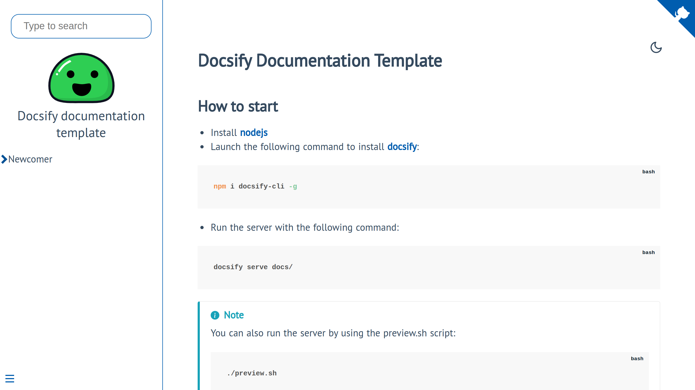
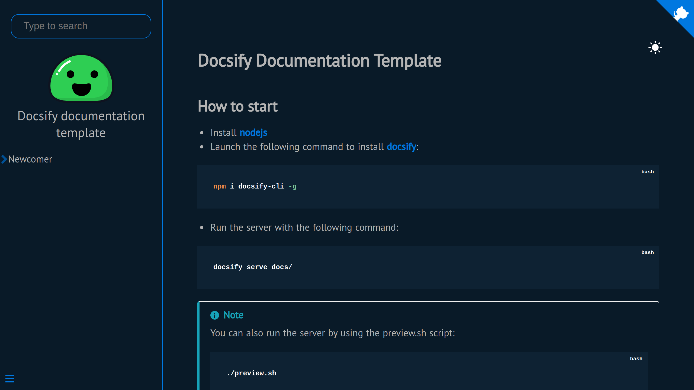
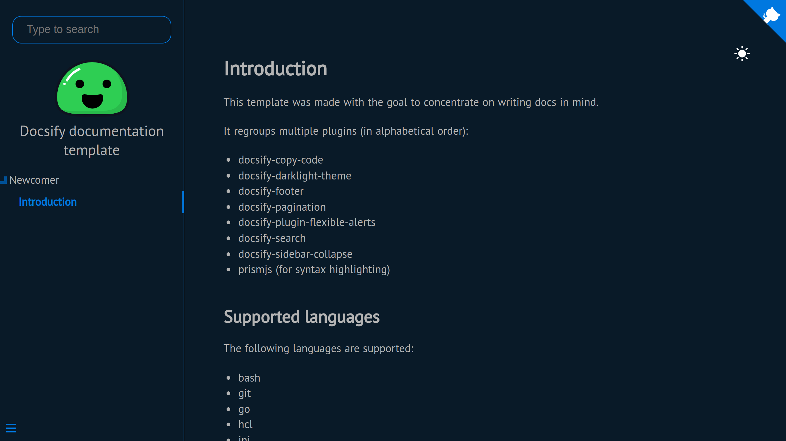

# Docsify Documentation Template

## How to start

- Install [nodejs](https://nodejs.org/en)
- Launch the following command to install [docsify](https://docsify.js.org/#/quickstart):

```bash
npm i docsify-cli -g
```

- Run the server with the following command:

```bash
docsify serve docs/
```

> [!NOTE]
> You can also run the server by using the preview.sh script:
>
> ```bash
> ./preview.sh
> ```

## Overview

Here is an overview of this theme:

- Homepage (Light theme)


- Dark Theme


- Navbar (open level)


## Contributing

The contributions are closed for the time being. I do not plan to modify it for now.
It was designed as a template. You can fork it and adapt it to your needs.

## Special thanks

I want to thank everyone working on the following projects (in no special order):

- The [docsify](https://github.com/docsifyjs/docsify) team for docsify
- [JP Erasmus](https://github.com/jperasmus) for [docsify-copy-code](https://github.com/jperasmus/docsify-copy-code)
- [Boopathi Kumar](https://github.com/boopathikumar018) for the [docsify-darklight-theme](https://github.com/boopathikumar018/docsify-darklight-theme)
- [imyelo](https://github.com/imyelo) for [docsify-pagination](https://github.com/imyelo/docsify-pagination)
- [Fabian Zankl](https://github.com/fzankl) for [docsify-plugin-flexible-alerts](https://github.com/fzankl/docsify-plugin-flexible-alerts)
- [iPeng6](https://github.com/iPeng6) for [docsify-sidebar-collapse](https://github.com/iPeng6/docsify-sidebar-collapse)
- [prismjs](https://github.com/PrismJS/prism) (for syntax highlighting)
